# Chevron

Chevron helps you build a labelled segmentation dataset out of images nobody has annotated yet.

You give it a folder of images. It gets mask proposals for them (from SAM, from an off-the-shelf
detector, or from a COCO file you already have) and discards whatever class labels those models came
with. It then groups the masks by appearance, so you can label a whole group at once instead of
clicking through them one at a time. When you're happy, it exports COCO.

It all runs as one local process. No database, no object store, no inference server, no accounts.

```bash
pip install -e ".[all]"       # everything: map, embeddings, SAM, faiss, hdbscan
chevron                       # http://127.0.0.1:7870
```

`[all]` is the install the Quickstart below assumes. The base install is CPU-only and pulls no torch,
which is deliberate — see [Installing less than everything](#installing-less-than-everything).

---

## Quickstart

About ten minutes, starting from a folder of images. The [Tutorial](#tutorial) below walks the same
path with screenshots.

**1. Start it.**

```bash
chevron                       # projects live in ~/.chevron/projects
```

Open <http://127.0.0.1:7870>. You'll see the launcher: a card per project, a New project button, and
**Add existing…** for a project folder Chevron did not create — an older run, or one kept next to its
images on another disk. Give it that folder, or the folder those projects live in, and it lists what it
finds. Adding one records its path; the folder itself does not move.

**2. Make a project.** Give it a name and point it at your image folder. From the shell instead:

```bash
curl -s -X POST localhost:7870/api/projects -H 'Content-Type: application/json' \
  -d '{"name":"My first project","config":{"images":{"root":"/data/my_images"}},"open":true}'
```

**3. Get masks.** A new project opens on **Set up**, which is the four steps between a folder of
images and something you can curate. Step 2 is the masks: pick a proposal source and press Get masks.
SAM is a good starting point, since it needs no trained model and fetches its checkpoint the first
time you use it. If you already have masks somewhere, pick COCO file and give it the path.

Sources you haven't installed still show up in the list, greyed out, with the pip command that would
enable them. There's more on the options in [Where masks come from](#where-masks-come-from).

The same thing from the shell:

```bash
curl -s -X POST localhost:7870/api/propose -H 'Content-Type: application/json' \
  -d '{"backend":"sam_auto","image_root":"/data/my_images","limit":50}'
# {"ok": true, "n_instances": 312, "n_images": 50}
```

**4. Embed the masks** so that similar ones end up near each other. Step 3: pick an embedding model
and press Compute features. Or:

```bash
curl -s -X POST localhost:7870/api/compute_features -H 'Content-Type: application/json' \
  -d '{"extractor":"dinov2"}'
```

**5. Cluster.** Step 4 groups the instances by those features and drops you into Curate. The rail on
the left fills up with partitions, which are just groups of instances that look alike. You can
re-cluster at any time from the Cluster button in Curate, after ticking a different set of features.

**6. Label.** Click a partition and its crops appear in the grid. If the group is all one thing, type
a class name in the inspector and hit Assign; the whole group gets labelled. If it's junk, hit Reject.
Mixed groups are the common case, so click or drag-paint to select the ones you want and assign only
those. Whatever you don't touch stays in the pool for the next pass.

**7. Export.** Ship, then Export. Or:

```bash
curl -s -X POST localhost:7870/api/export -H 'Content-Type: application/json' -d '{}'
# writes exports/curated.json: images, annotations with RLE segmentation, categories
```

---

## Tutorial

The Quickstart again, with pictures. One project goes from a folder of images to an exported COCO
file; a second project that already carries a few hundred labels stands in for the views that only
make sense once there is something to compare against. The pictures use the Penn-Fudan pedestrian
images, a CholecSeg8k clip and a chest X-ray project. All of them come out of
`docs/tutorial/capture.py`, which builds the projects and drives a browser through the UI, so they
can be regenerated after a UI change.

### 1. Set up a project

Start `chevron` and open <http://127.0.0.1:7870>. The launcher shows a card per project with its
counts and how far the curation has got. **Add existing…** takes a project folder that lives
somewhere else and records its path without moving it.

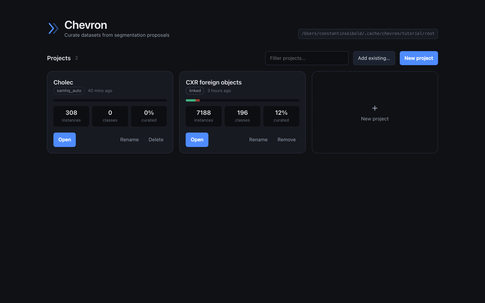

**New project** asks for a name and the folder your images are in. Only the name is fixed: the
folder can be changed later in Set up, and the proposal threshold can be overridden per run.

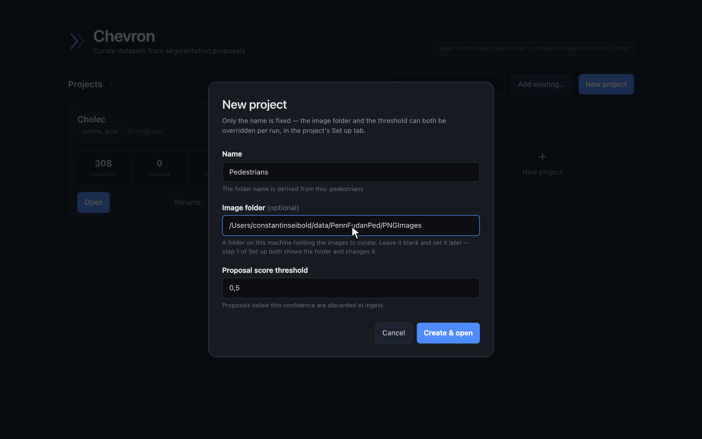

**Create & open** lands you on Set up, the four steps between a folder of images and something you
can curate. Step 1 is already ticked. Each later step is inert until the one before it has run, and
any step can be run again later, for more images or a different model.

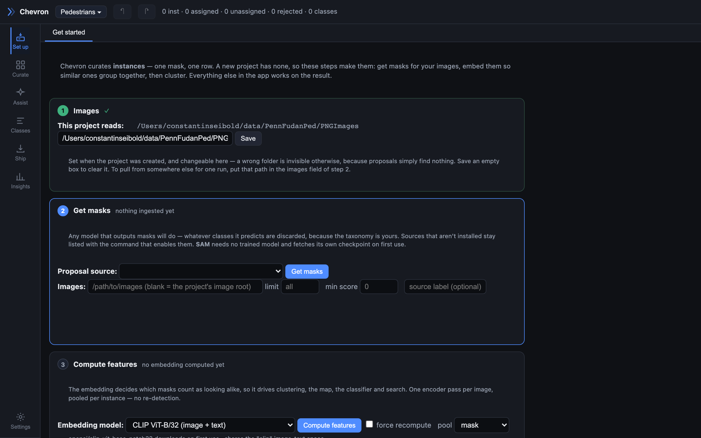

### 2. Get masks and features

Step 2 asks where the masks come from. Any model that outputs masks will do, because its class labels
are thrown away. SAM and SAM-HQ need no trained model and fetch their checkpoint on first use; a
**limit** caps how many images to process for a first look. While it runs, the line under the button
shows the phase, the count, the rate and an estimate, and says so if the job stalls.

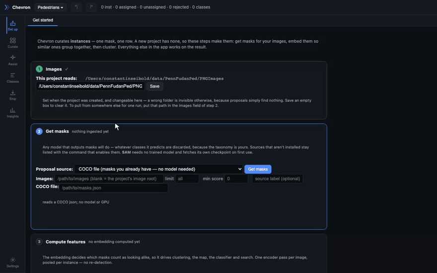

Step 3 embeds every mask with the model you pick. The embedding is what decides which masks look
alike, so it drives clustering, the map, the classifier and search. DINOv3 is a good general-purpose
choice, RAD-DINO is for chest X-rays, and CLIP or SigLIP also let you search the map by text.

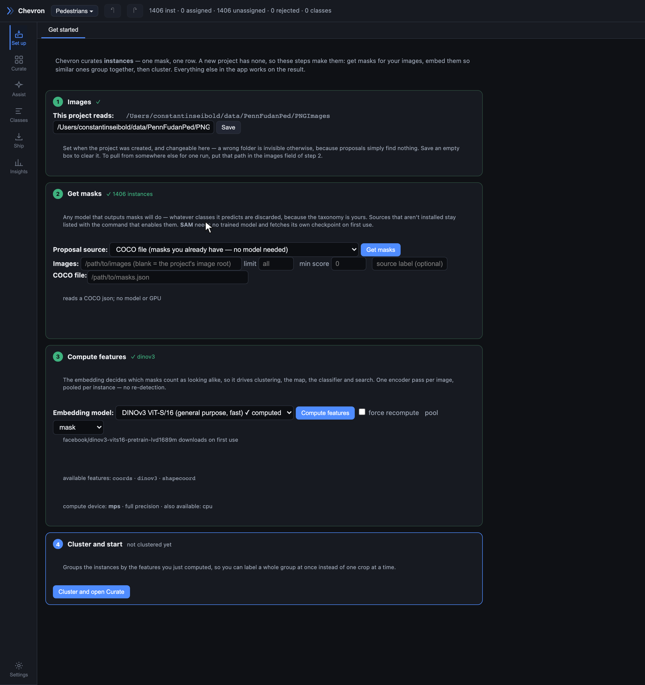

### 3. Browse the clusters

**Cluster and open Curate** groups the instances with FINCH, which has no `k` to pick. The rail on
the left lists the partitions largest first, with a group of classes above them once you have
labelled something and the rejected bin below. Click one and its crops fill the grid.

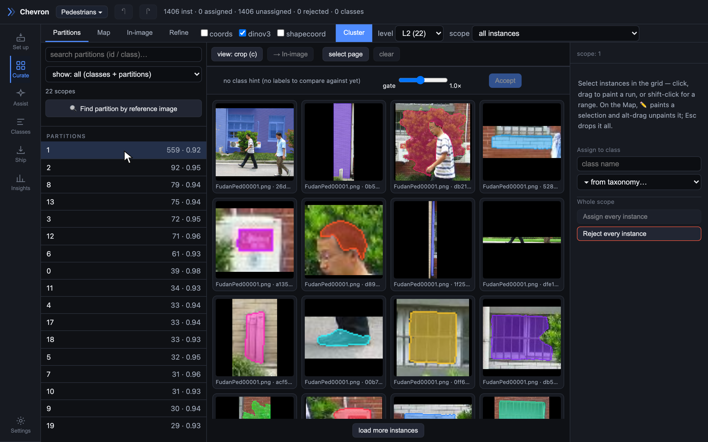

FINCH is hierarchical, so the **level** select trades many small groups for fewer big ones without
recomputing anything. `m` toggles the mask overlay on every crop and `c` switches between the crop
on its own and the crop inside its image.

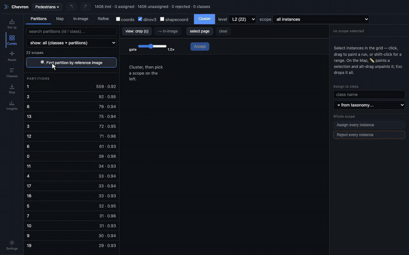

### 4. Browse the map

The Map view projects the same instances onto a plane, with h-NNE or, where h-NNE cannot fit the
set, UMAP; the info line says which. The wheel zooms about the pointer,
dragging pans, and hovering a point shows its crop. The points can be coloured by state, class,
partition, proposal source or detection score. Switching to **select** makes dragging paint a
selection, and Alt-drag erases. Clicking a scope in the rail lights its points and mutes the rest,
which is the quickest way to see whether a partition is one tight blob or scattered.

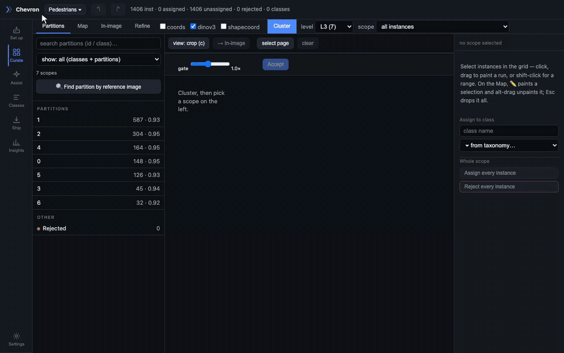

On a project with labels, colouring by class shows how the curation is going and which classes
spread across the space.

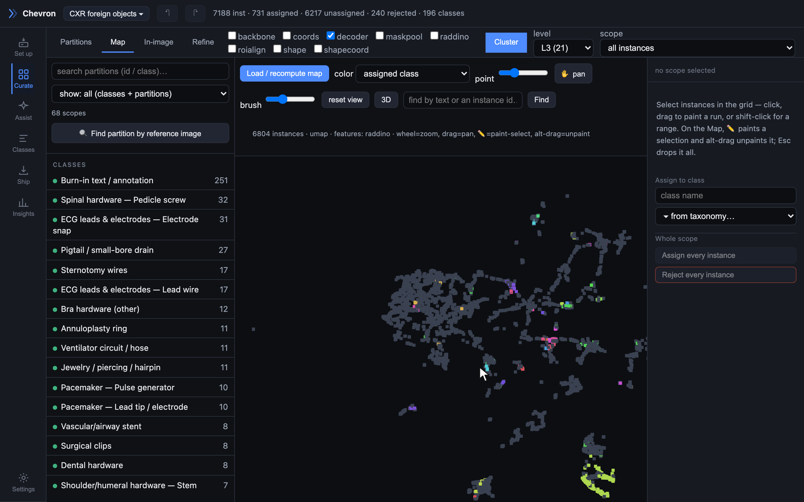

### 5. Label the clusters

Grid, Map and In-image share one selection, and the inspector on the right is the one place it is
acted on. Click a crop to toggle it, drag to paint a run, shift-click for a range. Type a class name
and **Assign**. When a whole partition is one thing, **Assign every instance** does it in one go;
when it is junk, **Reject** it. Everything is undoable from the header.

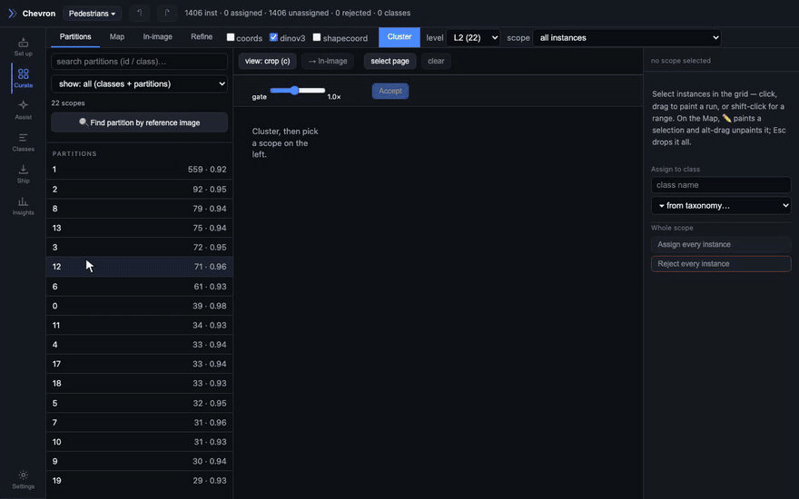

Once a few instances carry labels, every partition gets a suggestion: the class of its nearest
labelled neighbours, how confident that match is, and how likely the group is junk. Each crop wears
the same badge, and the ones the gate would act on get a dashed outline. The **gate** slider makes
the match stricter or looser.

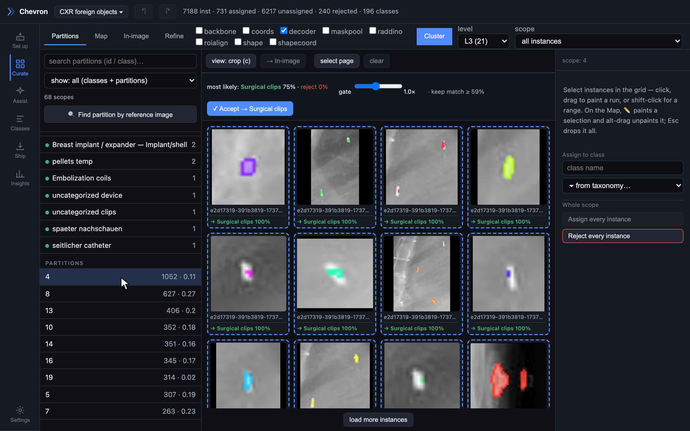

**Accept** applies the suggestion to the whole partition.

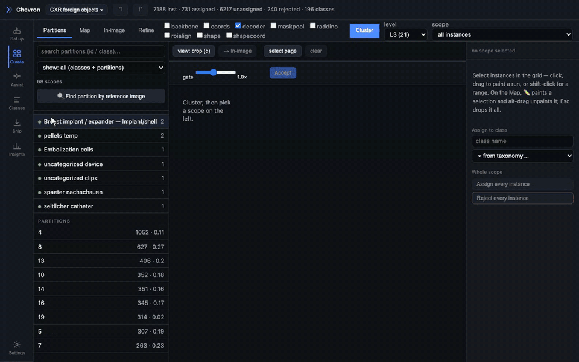

In-image shows one image with all of its instances, and can order the images by how much work is
left on them. It is where you go when a partition is mixed and the context decides.

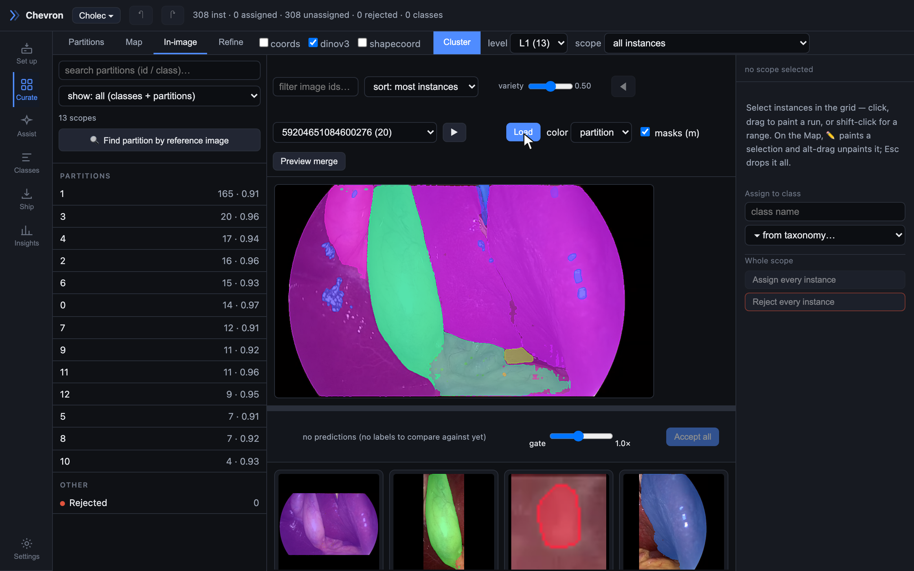

Assist ▸ Classifier trains a model on what you have labelled and previews what it would assign to
the rest. Apply it above a threshold, or use its uncertainty ranking to pick what to label next.

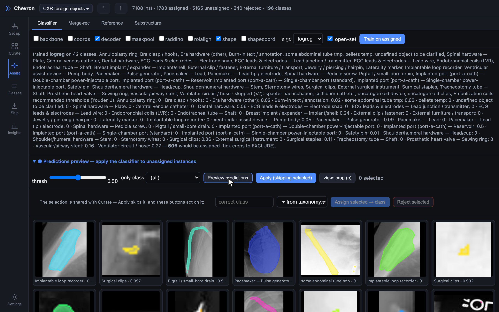

### 6. Build the taxonomy

Classes you type during curation are flat, and they collect in the temp bucket at the bottom of the
Classes tab. To fold duplicates together, tick them and merge them into one target, which is what
the GIF below shows. To promote a class into the tree, pick a concept from the dropdown on its row.
Temp classes work everywhere in the tool but stay out of the export.

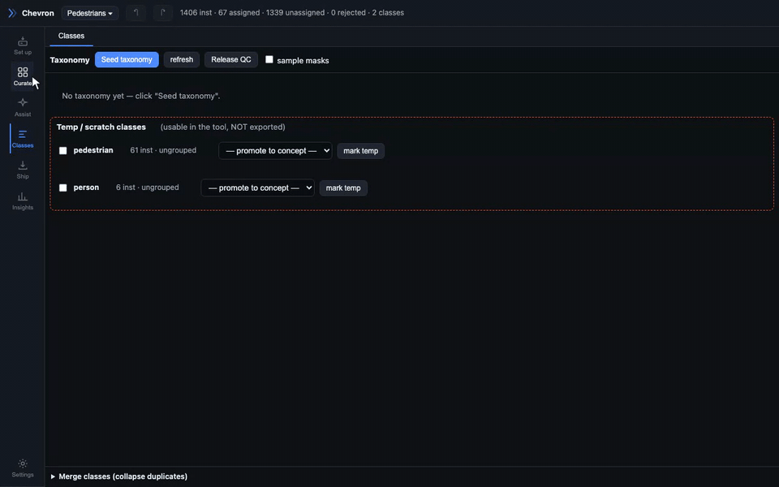

The tree is superclass ▸ concept ▸ part. **Seed taxonomy** loads the shipped chest X-ray one; for
other data, curate flat classes and group them, or give the seed endpoint a JSON of the same shape.
**Release QC** checks the part rules, such as a pacemaker body needing a lead, and names the images
that fail them.

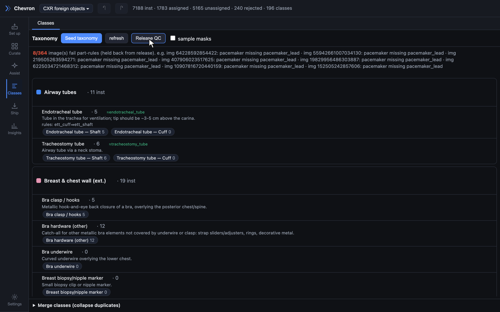

### 7. Export

Ship ▸ Release lists the images where every instance has been decided and more than one was kept.
Accept the ones you want shipped.

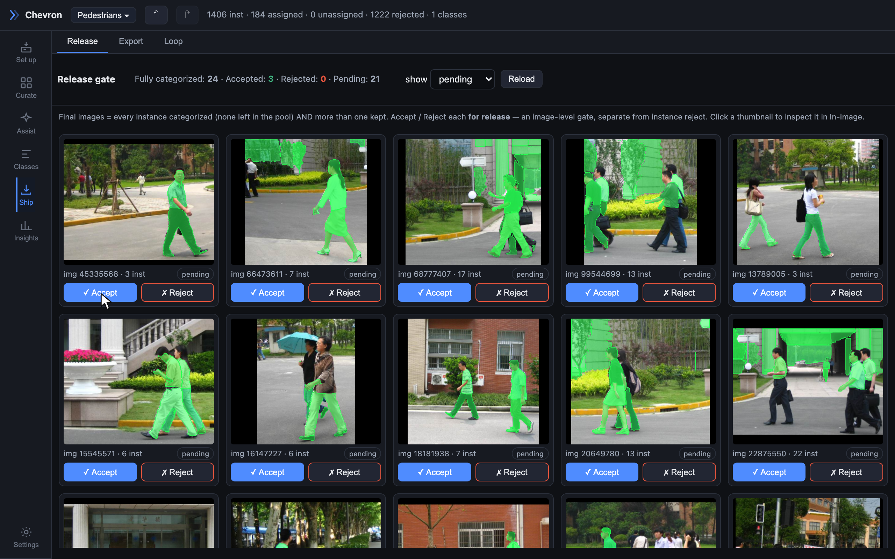

Ship ▸ Export writes `exports/curated.json`: images, annotations with RLE segmentation, categories.
**Partial labels** keeps unreviewed instances as ignore regions instead of background, for a project
that is not finished yet.

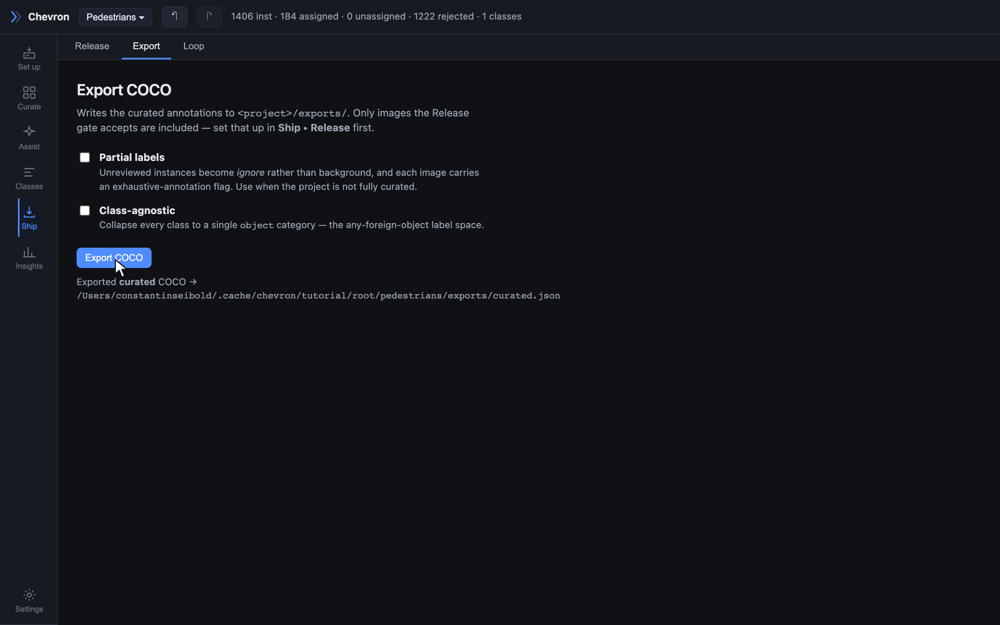

---

## Working in the UI

There are seven areas down the left:

| Area | What you do there |
|---|---|
| Set up | Where a project starts: the image folder, the proposal model, the embedding model, and the first clustering. Every other area is inert until this has run. |
| Curate | The main workspace. A scope rail on the left (partitions, classes, rejected bin, sub-clusters), the canvas in the middle, and an inspector on the right that acts on whatever you've selected. |
| Assist | Where the machine makes suggestions: a classifier trained on what you've labelled so far, a merge recommender, and reference-image search. |
| Classes | Your taxonomy. Create, rename, group, recolour. |
| Ship | Export, the release gate, and the retrain loop. |
| Insights | Statistics and an activity log. |
| Settings | The inference checkpoint, extra proposal sources, maintenance, and the scale tools. |

Curate's canvas has three views, and they share one selection, so you can switch between them without
losing your place.

- Grid shows crops, with a nearest-neighbour class suggestion on each.
- Map is a 2D or 3D plot of the latent space. You can orbit it, paint-select, and colour the points by
  state, class, partition, source or score. Typing a phrase or an instance id drops a query point onto
  the map so you can grab its neighbours.
- Image shows one image with all of its instances, ordered so the images with the most work left come
  first.

Undo and redo cover every action, and mask edits are stored as overlays, so your original masks are
never overwritten.

---

## Where masks come from

Whatever labels the proposal model produces get thrown away. A COCO detector's 80 classes aren't your
label space, and you're the one supplying the taxonomy.

| Backend | Needs | Use it when |
|---|---|---|
| `coco` | nothing | You already have masks in a COCO file. |
| `whole_image` | nothing | You want to label whole images rather than masks (see [Sample mode](#sample-mode)). |
| `sam_auto` | `chevron[sam]` | You have no model at all. The checkpoint downloads itself. |
| `samhq_auto` | `chevron[sam]` | Same, with sharper mask boundaries. |
| `torchvision_maskrcnn` | `torch` + `torchvision` | You want quick generic proposals. Runs fine on CPU. |
| `hf_seg` | `chevron[embed]` | Any HF `AutoModelForUniversalSegmentation`. Defaults to Mask2Former-COCO. |
| `qseg` | a qseg checkout + CUDA | You have a trained qseg model. Set `CHEVRON_QSEG_ROOT`. |

`GET /api/backends` returns the same list with availability and an install hint for each.

## Embedding models

The embedding is what decides which masks "look alike", so it drives the clustering, the map, the
classifier and nearest-neighbour search. You pick one in Set up, step 3.

| Model | Good for |
|---|---|
| `dinov3`, `dinov3b`, `dinov3l` | General purpose, in S/B/L sizes. The strongest dense features here, and a good default for natural-colour data such as endoscopy or surgical video. The weights are gated on Hugging Face, so accept the licence on the model page and run `hf auth login` before the first use. |
| `dinov2` | General purpose, and ungated, so it's the one to reach for if you don't want to deal with an access request. |
| `clip`, `siglip2` | General purpose, and they share an image-text space, which is what text queries on the map need. |
| `raddino` | Chest X-rays specifically. |

You can compute more than one and mix them with weights anywhere features are selected. Mask geometry
(`shape`, `shapecoord`, `coords`) is always there and needs no model.

## Speeding yourself up

Once a few hundred instances are labelled, there are some tools worth turning to:

- The classifier trains on your labels and predicts the rest. Predictions turn up as badges on the
  crops and you accept or ignore them.
- The merge recommender spots masks that are fragments of the same object, and it learns from the
  merges you accept.
- Reference search takes an uploaded picture of a thing and finds the partitions that look like it.
- Refine is a per-instance op chain (contrast, threshold, vessel trace, GrabCut, SAM/SAM-HQ), plus
  per-class rules, few-shot shape transfer, and a hand-draw editor for the ones that won't cooperate.

## Sample mode

If you want to label whole images rather than masks, create the project with `mode: "sample"` and
ingest with the `whole_image` backend. Clustering, the map, the classifier and search behave exactly
as they do for masks. The mask-only tools drop out of the nav, and Export writes a classification
manifest (`{file, class}`, as JSON and CSV) instead of COCO.

Text and video items aren't implemented.

## Using it on your own data

The curation loop doesn't know or care what your pixels depict: proposals go in, labels come out. It's
been used on chest X-rays because that's where it was written, not because of anything baked into the
core. If you're bringing a surgical-video, microscopy or aerial dataset:

- Use `dinov3` for the embedding model, or `dinov2` if you would rather avoid the gated download. RAD-DINO is the chest-X-ray one.
- Ignore the `taxonomy_seed.json` that ships with it, which is full of chest foreign bodies. It only
  gets applied if you press Seed. Make your own classes as you go, or supply your own seed JSON.
- The `vessel_extend` refine op is tuned for catheters, and it's only one op among many.

Beyond that you shouldn't need to change anything.

---

## Configuration

```bash
chevron                             # launcher over ~/.chevron/projects
chevron --root /data/projects       # ...over a different folder
chevron --project /data/projects/p1 # skip the launcher and open one project
chevron --port 8080 --host 0.0.0.0
```

A project does not have to sit under the root. **Add existing…** links one in place, and it then lists,
opens and exports like any other; the launcher's Remove forgets the link and leaves the folder alone
(Delete is only offered for projects that live under the root). From the shell:

```bash
curl -s -X POST localhost:7870/api/projects/scan -H 'Content-Type: application/json' \
  -d '{"path":"/data/old_runs"}'                       # what projects are in here?
curl -s -X POST localhost:7870/api/projects/link -H 'Content-Type: application/json' \
  -d '{"path":"/data/old_runs/ribs","open":true}'      # adopt one, in place
```

The compute device is chosen for you: CUDA if there is one, then Apple MPS, then CPU. Set up shows
which one you got, next to the model that will use it. To override it:

```bash
CHEVRON_DEVICE=cpu chevron          # force CPU
CHEVRON_DEVICE=cuda:1 chevron       # pick a particular GPU
CHEVRON_AMP=1 chevron               # turn on mixed precision for MPS, which is off by default
```

### Sharing it

Chevron binds to `127.0.0.1` and has no authentication of its own. The setup it's designed for is one
shared project reached over an SSH tunnel:

```bash
ssh -L 7870:localhost:7870 you@host
```

Concurrent edits get serialised, and the browser shows an "updated elsewhere" banner when someone else
changes something. It's still single-tenant and last-writer-wins, though, so if you're exposing it to
a network, put an authenticating proxy in front.

## Troubleshooting

**All the crops are black.** The project moved and the stored image paths don't resolve any more.
Images are loaded by absolute path, and a miss quietly becomes a black placeholder, which is why the
UI looks fine while showing you nothing. Repoint the paths at wherever the images live now.

**Getting masks reported success but nothing appeared.** Usually the image root points somewhere with
no images in it. Set up step 1 shows the path the project actually reads; step 2 takes a different
one if you'd rather pull from elsewhere.

**RAD-DINO won't download.** It sets `HF_HUB_OFFLINE=1`, so with no cached weights it fails offline
instead of fetching them. Run `export HF_HUB_OFFLINE=0` before you use it the first time.

**The 3D map won't open.** It needs WebGL, and software or remote GL, a driver blocklist or a
locked-down browser may not give it any. Chevron falls back to 2D and tells you why.

**Clustering says a feature is unusable.** The NaN check is global, so a single non-finite row takes
that feature out everywhere. Recompute it.

**The server dies with "Segmentation fault" or an OpenMP "already initialized" abort.** Several of
the packages Chevron uses (faiss, torch, scikit-learn) ship their own OpenMP runtime, and on macOS
more than one ends up loaded in the same process. Chevron sets `KMP_DUPLICATE_LIB_OK` and runs faiss
on a single thread to keep them out of each other's way. If it still happens, start with
`OMP_NUM_THREADS=1 chevron`.

## What's on disk

A project is an ordinary directory. There's no database.

```
<project>/
  state.json            config, taxonomy, per-instance labels, row order
  collection.pkl        records and feature matrices
  collection_shards/    append-only ingest shards, so a crash mid-ingest is recoverable
  history.jsonl         audit log, and what undo/redo reads
  refine/<iuid>.pkl     reversible mask edits
  cluster_cache/        cached clusterings
  exports/  snapshots/
```

Small writes go through `tmp` then `os.replace`, so they're atomic. To move a project, copy the
directory.

---

## Installing less than everything

The base install is CPU-only and torch-free on purpose: the whole test suite runs on it, which is what
keeps the core honest about not depending on any model stack. `[all]` is the convenience install;
these are the pieces it is made of.

| Extra | Brings | Needed for |
|---|---|---|
| *(base)* | numpy, scipy, scikit-learn/image, opencv, fastapi, pycocotools, finch | The server, the `coco` and `whole_image` backends, clustering, export. No torch. |
| `viz` | hnne, umap-learn, openTSNE, matplotlib | The latent-space Map, and projecting a query point into a fitted space. |
| `embed` | torch, transformers | Every embedding model, and the `hf_seg` backend. |
| `sam` | segment-anything, segment-anything-hq | The `sam_auto` / `samhq_auto` backends and SAM refinement. Needs `embed` for torch. |
| `faiss` | faiss-cpu | Faster nearest-neighbour search on large projects. |
| `cluster` | hdbscan | The HDBSCAN clustering method. |
| `dev` | pytest, httpx | The test suite. |

Two things `[all]` deliberately leaves out, because neither is pip-installable from here: `torchvision`
(install the CPU or CUDA wheel that matches your machine) for the `torchvision_maskrcnn` backend, and a
qseg checkout plus detectron2 for `qseg`.

MedSAM is not a package — it is a `vit_b` checkpoint loaded through the vanilla `segment_anything`
registry. Install `[sam]`, then point `CURATOR_MEDSAM_CKPT` at the `.pth`.

---

## Development

```bash
pip install -e ".[dev]"
pytest tests/ -q          # 549 tests, CPU-only, no model stack needed
git config core.hooksPath .githooks   # optional: run the tests before every push
python docs/tutorial/capture.py --help   # regenerates the Tutorial's screenshots (playwright + ffmpeg)
```

There is no CI. `.githooks/pre-push` runs the suite plus `node --check` over the frontend, and the
`git config` line above is what turns it on — once per clone, because git will not enable a hook
directory on its own. `git push --no-verify` skips it.

Python 3.12. Nothing in the source actually requires it, but with no CI matrix there is nobody
checking anything else, so `requires-python` says what is tested rather than what would probably
work.

The engine is `chevron/engine.py`, the HTTP layer is `chevron/server.py`, and the frontend is plain
JS in `chevron/web/` with no build step. Most of the reasoning behind a given design decision is in
the docstring of the module that implements it.

## Limitations

- No authentication. Single-tenant, last-writer-wins.
- Apple MPS has never actually run on Apple hardware. Device selection, the precision policy and the
  operator-gap fallback are all tested by simulation on every machine, but no Metal kernel has run.
- Text and video items aren't implemented.
- A project lives in RAM. The practical ceiling is somewhere around 1M instances on a 100 GB machine.
- The ML paths are under-tested, and there are no browser tests.

## Credits

Chevron is two projects merged together:

- The qseg curator, which is the instance-curation engine, extracted here along with its history.
- [Spacewalker](https://github.com/ConstantinSeibold/Spacewalker)
  ([arXiv:2409.16793](https://arxiv.org/abs/2409.16793), MIT, © 2024 Lukas Heine), which contributes
  the latent-space viewer, persisted dimensionality reduction with query projection, and the
  embedding and DR menus. They're generalised here so that a point can be an instance rather than
  only a whole sample.

MIT. `LICENSE` carries the full terms, along with the third-party notices for Spacewalker and
three.js.
